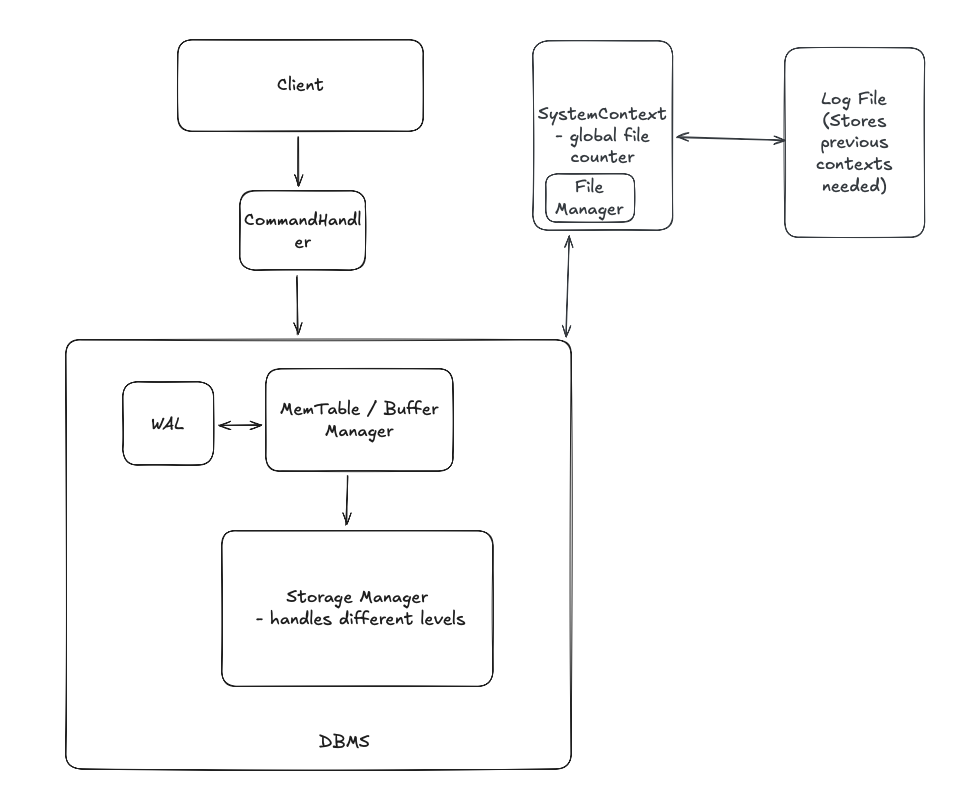
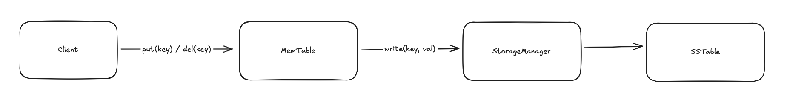
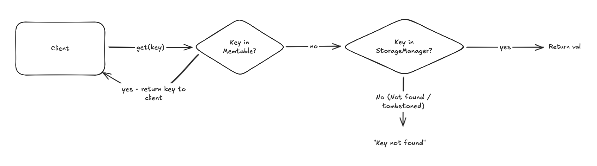

# Architecture

This document sketches the current storage engine design. It is intentionally high-level
and should be updated as the code evolves.

## Architecture Diagram

## Core Components

- Memtable: in-memory data structure holding recent writes (currently minimal in the codebase).
- WAL: write-ahead log for durability before flushing to disk.
- SSTables: immutable, sorted tables on disk.
- Levels: LSM-style levels for organizing SSTables.
- Compaction: merges overlapping SSTables and drops overwritten keys.
- Bloom filters: fast negative lookups for SSTables.

### 1. LevelManager

Currently, the DB works by loading all SSTables into memory for each level. This is extremely memory inefficient however, and will not scale well. Iterators prevent the need for this, by abstracting away the location of the data - callers don't need to know whether the data is in memory (eg. memtable, or on-disk SSTable).

## Data Flow

1. Write path
   

   - User writes go to the WAL.
   - Entries are applied to the memtable.
   - When the memtable becomes full, entries are flushed to an SSTable.

2. Read path
   
   - Check memtable first.
   - If key is not in memtable, consult SSTables, using Bloom filters to skip non-matching tables.
   - Resolve newest entries by timestamp or level order.

## File Layout

- WAL files: durable log of recent writes.
- SSTables: serialized entries plus metadata trailer (timestamp, file number).
- SSTable details: see `docs/file_layout.md`.

## Invariants and Assumptions

- SSTables are sorted by key with no duplicate keys inside a single file.
- Newer data overrides older data on the same key.
- Level 0 may contain overlapping SSTables; higher levels should not.

## Future Notes

- Add diagrams for compaction and level layout.
- Document concurrency and thread-safety assumptions.
